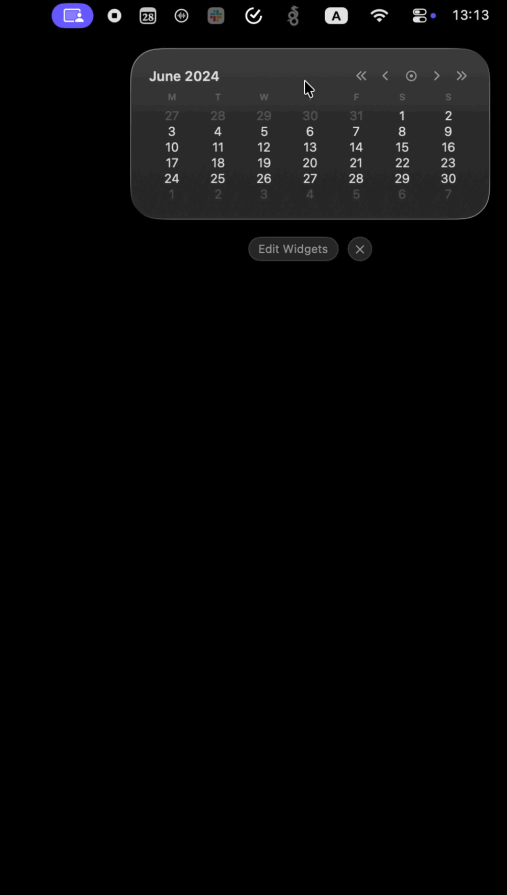

# Calendar Widget

Calendar Widget brings a fast, glanceable month calendar to macOS Notification Center and the desktop. It is made for the small moment when you need to check a date, move a few months ahead, or jump across the year without opening a full calendar app.

  

The widget stays quiet and lightweight. Today is clearly marked, adjacent-month days stay visible for context, and the controls are tuned for quick navigation: move by month, jump by year, or click the left and right sides of the calendar body to page through time.

## Highlights

- Interactive month calendar for Notification Center and desktop widgets
- Fast month navigation with arrows or broad left/right calendar zones
- Year jumps with compact double-arrow controls
- One-click return to the current month
- Clean native macOS look in Medium and Large sizes
- Locale-aware weekday order

## Get Calendar Widget

Download the latest DMG from [GitHub Releases](https://github.com/sgstq/macos-calendar-widget/releases/latest), open it, and drag Calendar Widget into Applications. After opening the app once, add Calendar from Notification Center's widget gallery.
