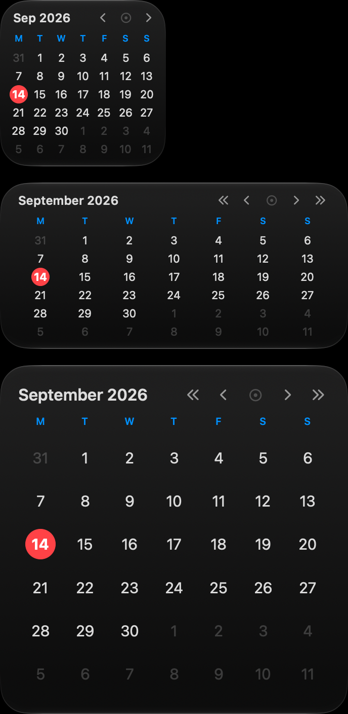

# Calendar Widget

Calendar Widget brings a fast, glanceable month calendar to macOS Notification Center and the desktop. It is made for the small moment when you need to check a date, move a few months ahead, or jump across the year without opening a full calendar app.

<p align="center">
  
</p>

The widget stays quiet and lightweight. Today is clearly marked, adjacent-month days stay visible for context, and the controls are tuned for quick navigation: move by month, jump by year, or click the left and right sides of the calendar body to page through time.

## Highlights

- Interactive month calendar for Notification Center and desktop widgets
- Fast month navigation with arrows or broad left/right calendar zones
- Year jumps with compact double-arrow controls
- One-click return to the current month
- Clean native macOS look in Small, Medium, and Large sizes
- Locale-aware weekday order

## Get Calendar Widget

Download the latest DMG from [GitHub Releases](https://github.com/jdpurcell/macos-calendar-widget/releases/latest), open it, and drag Calendar Widget into Applications. After opening the app once, add Calendar from Notification Center's widget gallery.

## Development

Built with SwiftUI + WidgetKit and generated from `project.yml` via [XcodeGen](https://github.com/yonaskolb/XcodeGen). Releases are built and packaged by [`.github/workflows/release.yml`](.github/workflows/release.yml).

### Release procedure

To publish a release, commit the desired changes, then create and push a version tag:

```sh
git tag v1.2.3
git push origin v1.2.3
```

Only pushed `vX.Y.Z` tags trigger releases. The workflow builds the tagged commit, uses that version for the app and DMG, and publishes a GitHub release with automatically generated notes after signing and notarization succeed. Ordinary branch pushes do not release anything.

### Release signing

Configure these GitHub Actions repository secrets:

| Secret | Value |
| --- | --- |
| `APPLE_DEVID_APP_CERT_DATA` | Base64-encoded Developer ID Application certificate and private key exported as a `.p12` |
| `APPLE_DEVID_APP_CERT_PASS` | Password for the `.p12` |
| `APPLE_ID_USER` | Apple ID used for notarization |
| `APPLE_ID_PASS` | App-specific password for that Apple ID |

The workflow signs the widget extension and app with hardened runtime, secure timestamps, and their sandbox entitlements, then creates and signs the DMG. The Team ID is read from the certificate name.

Only the DMG is submitted for notarization. After Apple accepts it, the workflow staples and validates the DMG ticket before publishing. The app is not separately stapled; first launch may require an internet connection.
